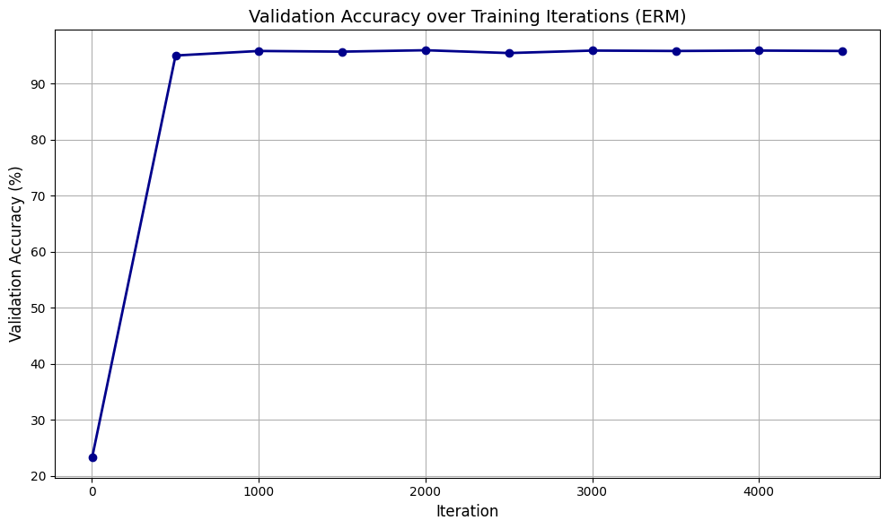
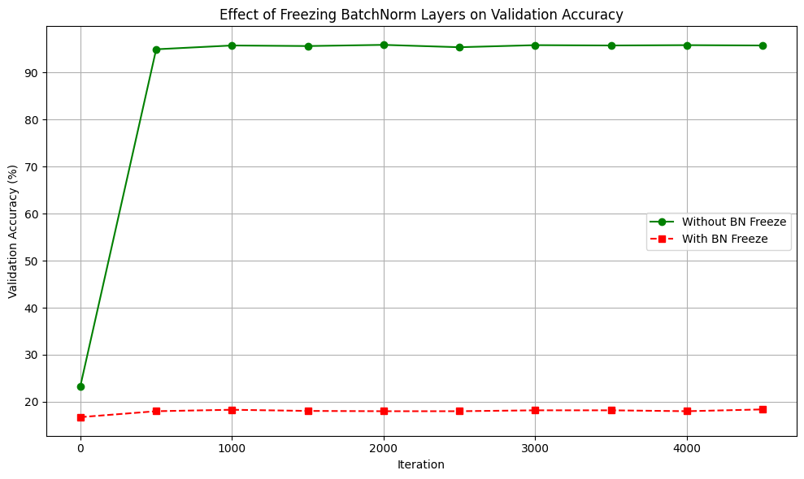
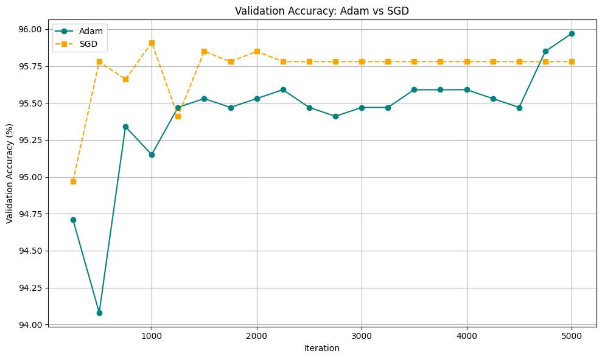
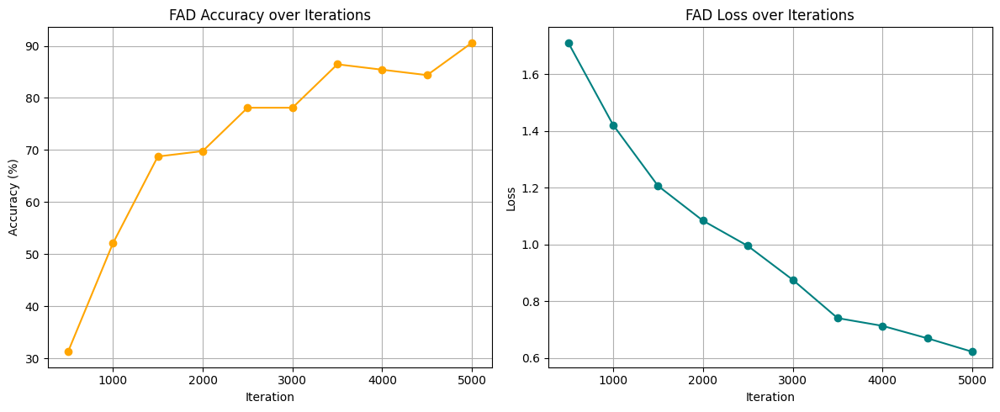
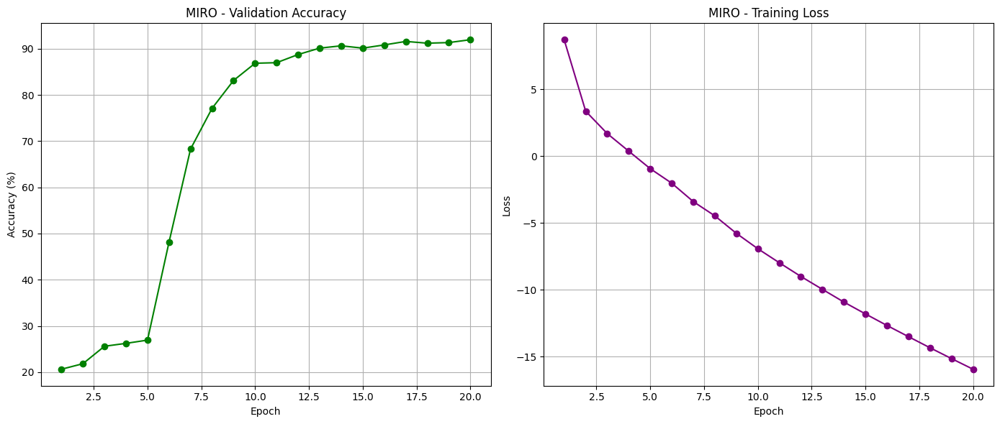

Exploring Domain Generalization techniques including ERM, FAD Optimizer, and MIRO Regularization on the PACS dataset using PyTorch
# Domain Generalization and Regularization Strategies

This repository contains the implementation for the second part of the "Trustworthy AI" project. In this section, we focus on **Domain Generalization (DG)**, where the goal is to train a model on multiple source domains such that it can generalize well to an unseen target domain without any adaptation.

## Project Objectives
- Establish a strong baseline using Empirical Risk Minimization (ERM).
- Investigate the critical role of Batch Normalization (BatchNorm) statistics in domain generalization.
- Compare the stability and generalization performance of Adam and SGD optimizers.
- Implement and evaluate advanced optimization and regularization techniques:
  - **FAD (Flatness-Aware Minimization)**
  - **MIRO (Mutual Information Regularization with Oracle)**

## Experimental Results and Analysis

### 1. ERM Baseline
We trained a ResNet18 model using standard Empirical Risk Minimization. The validation accuracy over 5000 iterations provides our baseline for comparison.


### 2. The Impact of Freezing BatchNorm
We investigated what happens when the statistics of Batch Normalization layers are frozen during training. The results demonstrate a severe performance drop, highlighting the importance of domain-specific running statistics in the generalization process.


### 3. Optimizer Comparison: Adam vs. SGD
We compared how different optimizers traverse the loss landscape and their resulting generalization capabilities.


### 4. Flatness-Aware Minimization (FAD)
We implemented a custom `FADOptimizer` to seek flatter minima in the loss landscape, which theoretically improves generalization. However, our experiments showed that FAD struggled on this specific test setup, achieving only **60.55% accuracy**. A detailed discussion of why FAD failed to generalize effectively on the target domain is included in the notebook.


### 5. MIRO Regularization
We implemented the `MIRORegularizer`, which penalizes the covariance distance of features between the intermediate layers of a pre-trained model and our training model. Unlike FAD, which focuses on flat minima in weight space, MIRO enforces feature-level regularization.


## Repository Structure
```text
.
├── assets/                     # Training charts and performance plots
├── data/                       # PACS dataset directory
│   └── README.md               # Instructions for data loading (DomainBed protocol)
├── notebooks/
│   └── Q2_Domain_Generalization.ipynb  # Main Jupyter notebook
├── README.md                   # This file
└── requirements.txt            # Python dependencies
```

## How to Run
1. Create a virtual environment and install the dependencies:
   ```bash
   pip install -r requirements.txt
   ```
2. Place the PACS dataset inside the `data` folder (refer to `data/README.md` for structure).
3. Open `notebooks/Q2_Domain_Generalization.ipynb` to run the experiments.
